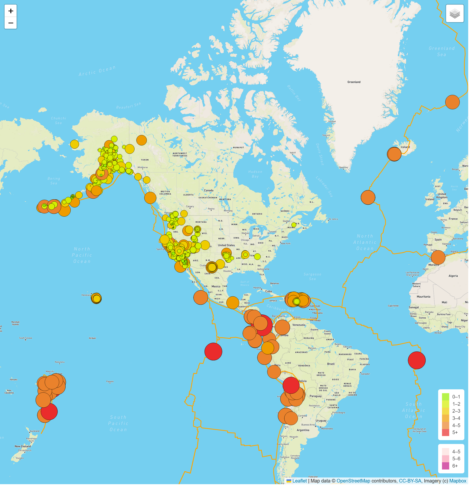
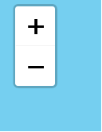
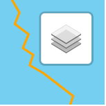
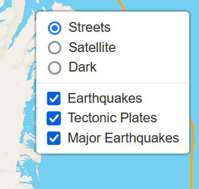
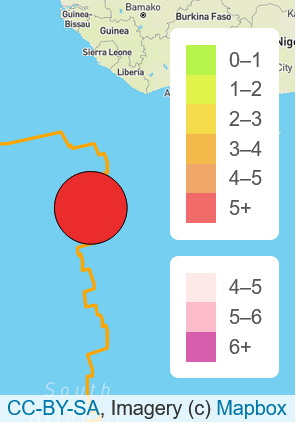
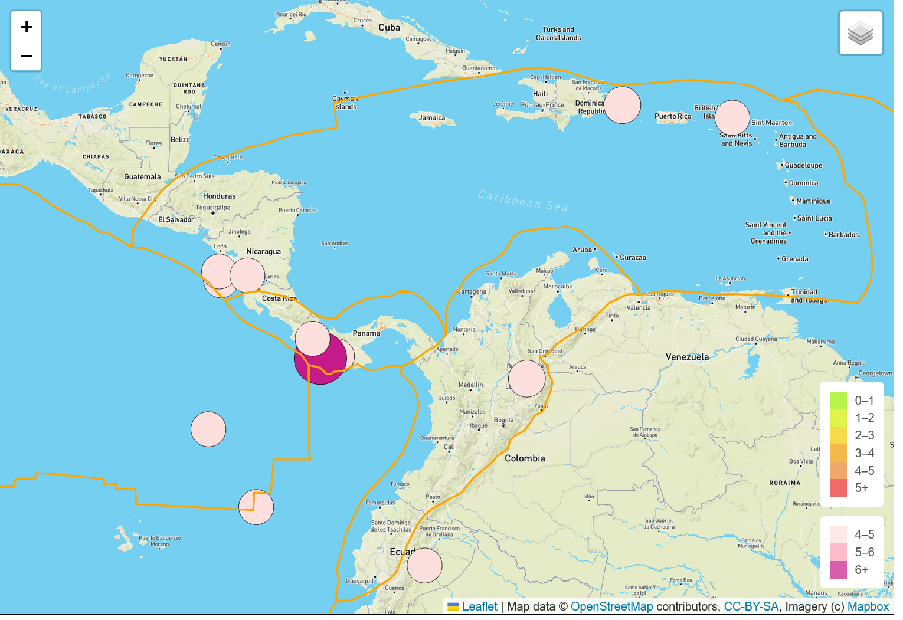
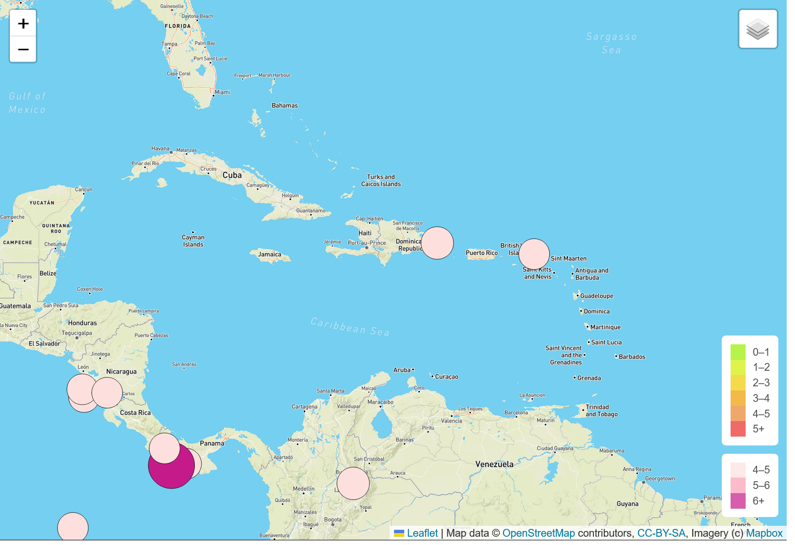
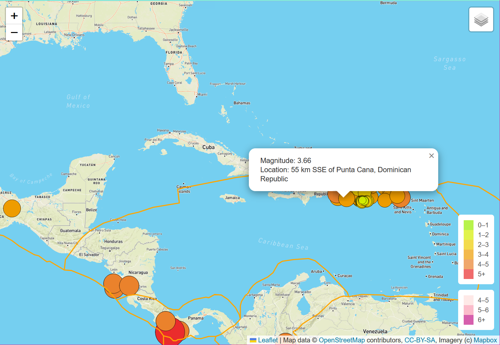

# Mapping Earthquakes with Leaflet.js and Javascript
## Overview
This project developed an interactive map for geologic information, such as the location and magnitude of earthquakes, and the outlines of the tectonic plates.

The earthquake data was retrieved from the U.S. Geological Society's website in geoJSON format.  Similarly, the tectonic plate data was retrieved from github in geoJSON format.

Within the map, the user can select from three types of maps and can toggle the earthquake and tectonic plate overlays to view the data as they wish.

## Technology
This project included the following technologies:
* HTML - information display via the internet
* Javascript - programming language for reading and processing JSON data
* leaflet.js - mapping data visualization library driven by Javascript
* mapbox - map data provider with published APIs

## Map Features
Upon initialization, the map displays all of the earthquake data with colors and circle sizes that correspond to the intensity of each quake.  The lines for the tectonic plate outlines are also displayed.

### Controls

In the upper left, there is a zoom control that the user can click to zoom in or out of the map.

In the  upper ritht, there is a layer control where the user can select the type of map, and the data overlays.

   

In the lower right of the map, legends are displayed for the two earthquake data views.

### Data Display
The user can select the data to view on the map.  The map updates the presentation when the layer controls are modified.

Below is an image of the map displaying the Major Earthquake data alongside the tectonic plate outlines.

Now the tectonic plates have been removed from the view.

The user can use their mouse to change the map position by clicking and dragging.  When any earthquake marker is clicked, a popup is displayed to show the magnitude and location of the earthquake.

